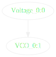
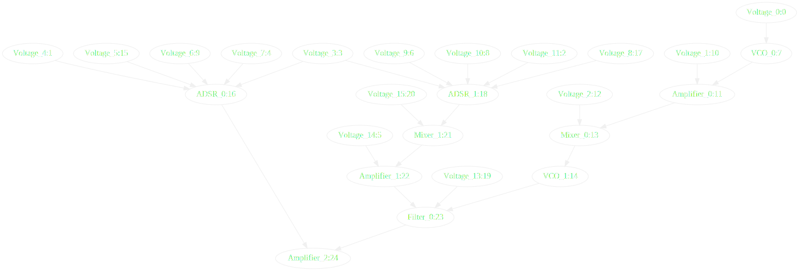
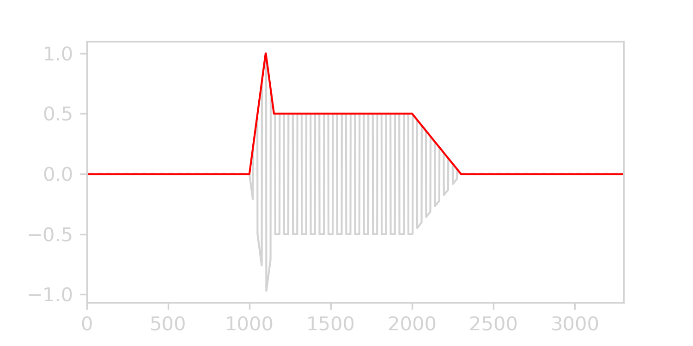
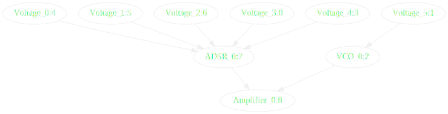
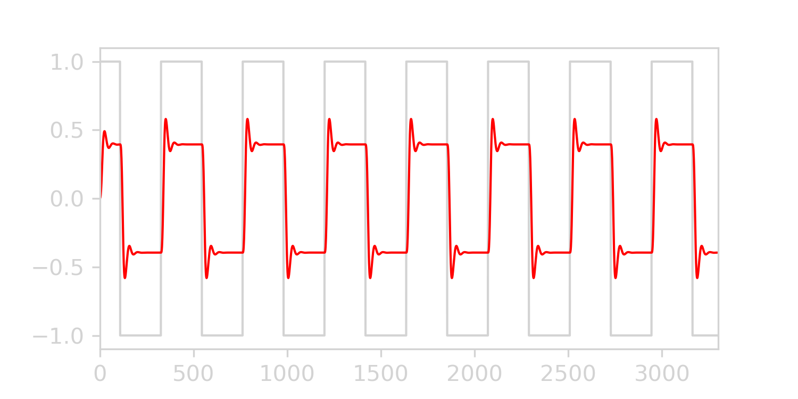
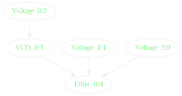
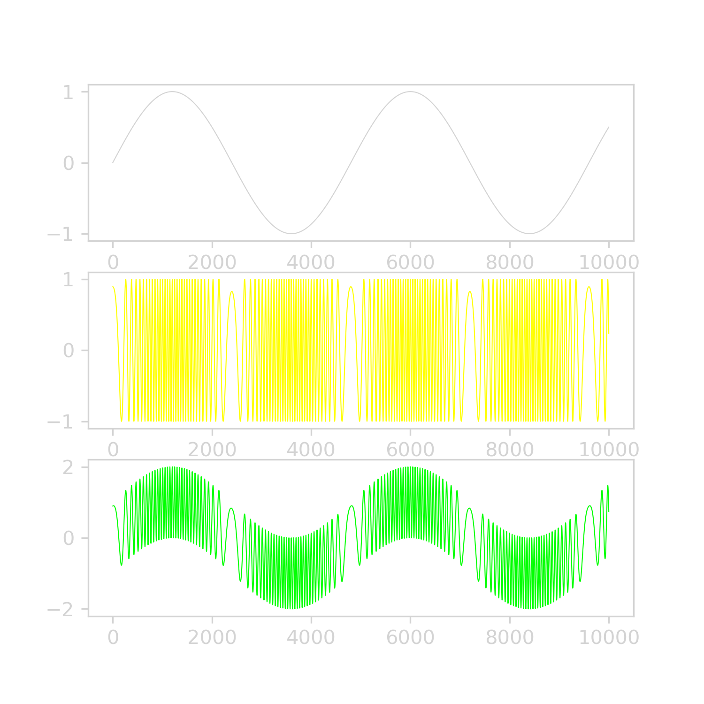
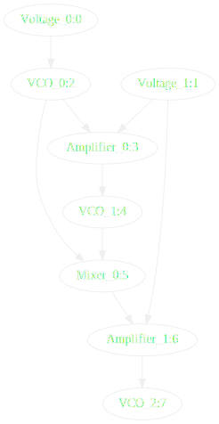

# Mini-Synth

Mini-synthesizer with modular philosophy built from scratch in Python.

**Modules implemented :**
- Voltage Controlled Oscillator (and Low Frequency Oscillators)
- Amplifier
- ADSR envelope
- Low-Pass Filter
- Mixer
- Constant

I built this mainly for educational purposes, even though it can be played as it is.

## How it works
Following the philosophy of **modular synthesizers**, every module output can be connected to any other module input.  

Regarding the software architecture, I used a **graph traversal** method which computes all intermediary values in the correct order.

As a consequence, each module inherits from a `Node` class. `Nodes` are managed by a custom implementation of a Directed Graph `DiGraph`, which register each module as `Nodes`. The order is computed via a DFS based topological sort algorithm. 

```python
def topo_sort(self, l = None, visited = None):
    l = [] if l is None else l
    visited = {k:False for k in self.nodes} if visited is None else visited
    for u in self.nodes:
        if not visited[u]:
            self.dfs(u, l, visited)
    return l

def dfs(self, u, l, visited):
    visited[u] = True
    for v in self.succ[u]:
        if not visited[v]:
            self.dfs(v, l, visited)
    l.insert(0, u)
```

The modular `Rack`, in which are added modules (like `VCO`, `Amplifier`, etc...) does the heavy lifting of  dependency computation and update loop behind the scenes.

## Getting started
Below is a minimalist example of the creation of a rack with one VCO.

```python
from synth.rack import Rack
from synth.vco import VCO
from synth.voltage import Voltage

# Create a new rack
rack = Rack()

# Create control voltages for VCO frequency
vco_freq = Voltage(220)

# Create a VCO modulated with LFO
vco = VCO(vco_freq, fs = rack.fs) 

# Register modules in declared order
for module in [vco_freq, vco]:
    rack.add_object(module)

# Run steps
for _ in range(1000):
    rack.step()
```
Or
```python
python -m examples.simple
```

We can plot the dependency graph of this rack. 

<p align="center">
  
</p>

## Examples
The `/examples` folder has more advanced usages, the most complete being `midi.py`, which integrated every module to demonstrate those capabilities :
- Filter and amplitude envelopes
- VCO with midi based control
- Vibrato with LFO on midi CC
- Low-pass filter
- Real-time audio stream

Below is the computational graph of its internal representation (`./synth/minisynth.py`).

<p align="center">
  
</p>

```python
python -m examples.midi
```
**Care to change your input midi device if you were to run this**.

### ADSR
Attack-Delay Sustain Release envelope.  
`./examples/adsr.py`
<p align="center">
  
</p>
<p align="center">
  
</p>

```python
python -m examples.adsr
```

### Filter
Moog-like 4-ladder resonance low pass filter.  
`./examples/filter.py`
<p align="center">
  
</p>
<p align="center">
  
</p>

```python
python -m examples.filter
```

### Frequency Modulation
LFO piloting VCO.  
`./examples/modulation.py`
<p align="center">
  
</p>
<p align="center">
  
</p>

```python
python -m examples.modulation
```

## Dependencies
`python 3.9`  
`numpy`  
`graphviz` # for graph plotting   
`pyaudio` # for audio streaming  
`mido` # for midi handling  
`python-rtmidi` # for midi handling  
